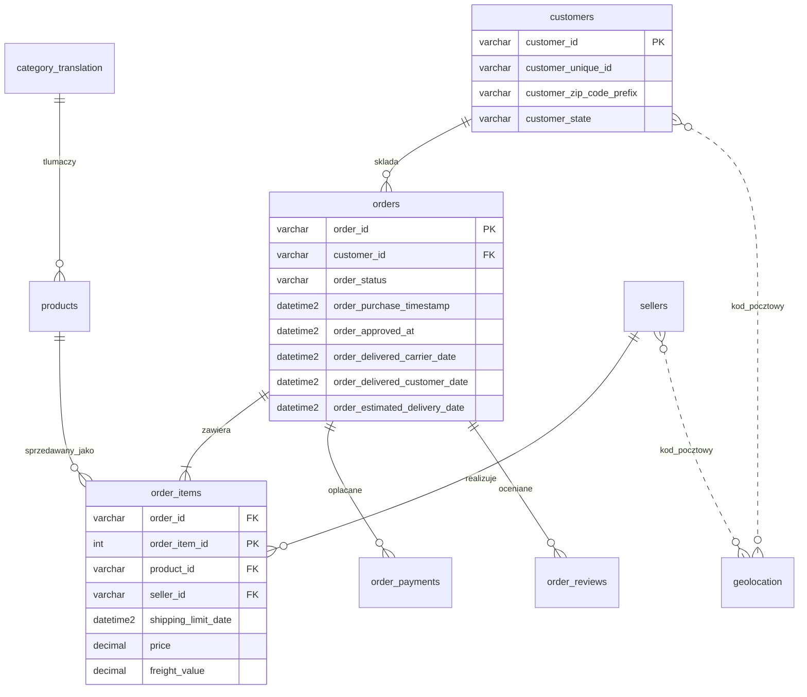

# Schemat danych Olist

```mermaid
erDiagram
customers ||--o{ orders : sklada
orders ||--|{ order_items : zawiera
orders ||--o{ order_payments : oplacane
orders ||--o{ order_reviews : oceniane
products ||--o{ order_items : sprzedawany_jako
sellers ||--o{ order_items : realizuje
category_translation ||--o{ products : tlumaczy
customers }o..o{ geolocation : kod_pocztowy
sellers }o..o{ geolocation : kod_pocztowy
orders {
varchar order_id PK
varchar customer_id FK
varchar order_status
datetime2 order_purchase_timestamp
datetime2 order_approved_at
datetime2 order_delivered_carrier_date
datetime2 order_delivered_customer_date
datetime2 order_estimated_delivery_date
}
order_items {
varchar order_id FK
int order_item_id PK
varchar product_id FK
varchar seller_id FK
datetime2 shipping_limit_date
decimal price
decimal freight_value
}
customers {
varchar customer_id PK
varchar customer_unique_id
varchar customer_zip_code_prefix
varchar customer_state
}
```
