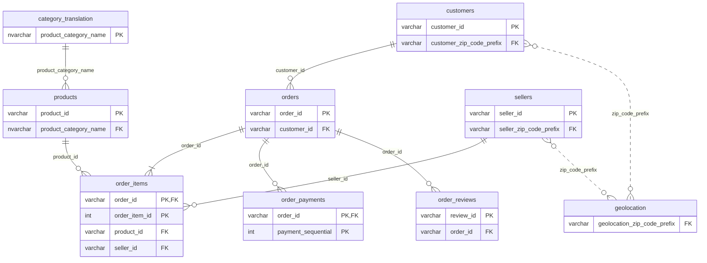

# Schemat danych Olist

```mermaid
erDiagram
customers ||--o{ orders : "customer_id"
orders ||--|{ order_items : "order_id"
orders ||--o{ order_payments : "order_id"
orders ||--o{ order_reviews : "order_id"
products ||--o{ order_items : "product_id"
sellers ||--o{ order_items : "seller_id"
category_translation ||--o{ products : "product_category_name"
customers }o..o{ geolocation : "zip_code_prefix"
sellers }o..o{ geolocation : "zip_code_prefix"

%% TABELE

orders {
    varchar order_id PK
    varchar customer_id FK
}

order_items {
    varchar order_id PK, FK
    int order_item_id PK
    varchar product_id FK
    varchar seller_id FK
}

order_payments {
    varchar order_id PK, FK
    int payment_sequential PK
} 

order_reviews {
    varchar review_id PK
    varchar order_id FK
}

customers {
    varchar customer_id PK
    varchar customer_zip_code_prefix FK
}

products {
    varchar product_id PK
    nvarchar product_category_name FK
}

sellers {
    varchar seller_id PK
    varchar seller_zip_code_prefix FK
}

category_translation {
    nvarchar product_category_name PK
}

geolocation {
    varchar geolocation_zip_code_prefix FK
}

```
